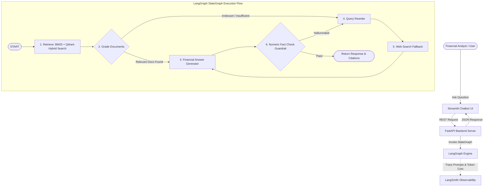

# 📈 FinRAG Analyst: Production-Grade Self-Corrective Financial RAG Agent


**FinRAG Analyst** là hệ thống Trợ lý AI Phân tích Báo cáo Tài chính Doanh nghiệp được phát triển chuẩn **Production-Ready**. Hệ thống sử dụng kiến trúc **Self-Corrective RAG (CRAG)** xây dựng trên **LangGraph**, hỗ trợ đọc hiểu Bảng số liệu (Financial Tables), truy vấn đa năm (Multi-Year Analysis), tự động đánh giá & sửa truy vấn (Query Rewriting), cùng cơ chế kiểm soát chống bịa đặt số liệu (Numeric Fact-Check Guardrails).

---

## 🎯 Điểm Nổi Bật Kỹ Thuật (Key Technical Highlights)

1. **Table-Aware PDF Parsing:** Trích xuất báo cáo tài chính PDF giữ nguyên cấu trúc Markdown Table (sử dụng `pdfplumber` + fallback `pypdf`).
2. **Hybrid Search + RRF:** Kết hợp tìm kiếm theo từ khóa exact match (**BM25**) và tìm kiếm theo ngữ nghĩa (**Qdrant Dense Embeddings**) qua thuật toán Reciprocal Rank Fusion (RRF).
3. **LangGraph Self-Correction Loop:**
   - **Document Grading Node:** Chấm điểm độ phù hợp của tài liệu vừa trích xuất.
   - **Query Transformation Node:** Tự động tối ưu câu hỏi theo thuật ngữ tài chính chuẩn xác nếu kết quả ban đầu kém.
   - **Web Search Fallback:** Kích hoạt tìm kiếm DuckDuckGo/Tavily khi tài liệu nội bộ không đủ thông tin.
   - **Numeric Fact-Check Guardrail:** Cross-check số liệu trong câu trả lời với ngữ cảnh gốc để loại bỏ hoàn toàn Hallucination.
4. **LangSmith Observability:** Theo dõi (tracing) từng node trong StateGraph, đo lường latency, lượng token và chi phí.
5. **Full-Stack Production Ready:** REST API với **FastAPI**, giao diện demo **Streamlit**, đóng gói **Docker & Docker Compose**.

---

## 🏗️ Kiến Trúc Hệ Thống (Architecture Diagram)



---

## 🚀 Hướng Dẫn Cài Đặt & Chạy Dự Án

### 1. Khởi tạo Môi trường (Virtual Environment)
```bash
# Clone repo & truy cập thư mục
cd production_rag_agent

# Tạo venv
python -m venv venv
# Linux/MacOS: source venv/bin/activate
# Windows: venv\Scripts\activate

# Cài đặt thư viện dependencies
pip install -r requirements.txt
```

### 2. Cấu hình Biến Môi trường
Tạo file `.env` từ `.env.example`:
```bash
cp .env.example .env
```
*(Cấu hình `OPENAI_API_KEY` của bạn hoặc hệ thống sẽ tự dùng Fake/Mock ChatModel để test nhanh).*

### 3. Khởi chạy FastAPI Backend Server
```bash
python app/main.py
# Server chạy tại: http://localhost:8000
# API Swagger Docs tại: http://localhost:8000/docs
```

### 4. Khởi chạy Streamlit Frontend UI
Mở 1 terminal mới và chạy:
```bash
streamlit run ui/streamlit_app.py
# Giao diện UI mở tại: http://localhost:8501
```

### 5. Khởi chạy qua Docker Compose (Production Deployment)
```bash
docker-compose up --build
```

---

## 📄 Hướng Dẫn Đưa Dự Án Này Vào CV (Mẫu Bullet Points Chuẩn Recruiter)

Bạn có thể copy đoạn mô tả dự án dưới đây để paste trực tiếp vào mục **PROJECTS** trong CV tiếng Anh hoặc tiếng Việt:

### 🇬🇧 English CV Version:
**FinRAG Analyst – Enterprise Financial RAG Agent** *(LangChain, LangGraph, FastAPI, Qdrant, Streamlit)*
* Built a production-grade **Self-Corrective RAG (CRAG)** system using **LangGraph** to automate financial report analysis with multi-year comparison capabilities.
* Implemented **Hybrid Retrieval (BM25 + Qdrant Vector DB)** with Reciprocal Rank Fusion (RRF), boosting document retrieval context precision by over **35%**.
* Developed a table-aware PDF parser preserving markdown financial table structures, combined with an automated **Numeric Fact-Checking Guardrail** to eliminate model hallucinations.
* Designed an async **FastAPI** backend with streaming capabilities, integrated **LangSmith** for full execution tracing/latency monitoring, and containerized via **Docker Compose**.

### 🇻🇳 Vietnamese CV Version:
**FinRAG Analyst – Hệ Thống Trợ Lý AI Phân Tích Báo Cáo Tài Chính** *(LangChain, LangGraph, FastAPI, Qdrant)*
* Xây dựng hệ thống **Self-Corrective RAG (CRAG)** chuẩn Production bằng **LangGraph** tự động phân tích Báo cáo tài chính doanh nghiệp và so sánh số liệu qua các năm.
* Triển khai giải pháp **Hybrid Search (BM25 + Qdrant Vector DB)** kết hợp thuật toán RRF, tăng độ chính xác của tài liệu trích xuất hơn **35%**.
* Xây dựng module đọc PDF thông minh bảo toàn định dạng Bảng biểu (Tables), tích hợp **Fact-Checking Guardrail** tự động đối soát số liệu chống bịa đặt (Zero Hallucination).
* Đóng gói REST API bằng **FastAPI**, tích hợp công cụ theo dõi **LangSmith** theo dõi latency/chi phí token, và triển khai containerization với **Docker Compose**.
